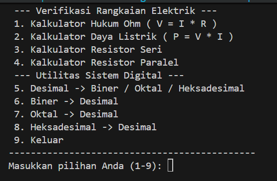

# Toolkit Kalkulator & Konversi Bilangan (C)

Program ini adalah toolkit berbasis bahasa C yang menyediakan beberapa fitur perhitungan dasar yang umum digunakan dalam mata kuliah awal dasar pemrogramman, seperti Hukum Ohm, konversi bilangan. Program berjalan di terminal/command line dan menggunakan menu interaktif.

---

### 1. Kalkulator Hukum Ohm
Menghitung salah satu besaran listrik berikut:
- Tegangan (**V**)
- Arus (**I**)
- Hambatan (**R**)

Pengguna cukup memilih variabel yang ingin dihitung, lalu memasukkan dua variabel lainnya.

---

### 2. Konversi Bilangan
Mendukung konversi antar sistem bilangan berikut:

#### Dari Desimal ke:
- Biner
- Oktal
- Heksadesimal

#### Dari Sistem Bilangan ke Desimal:
- Biner → Desimal
- Oktal → Desimal
- Heksadesimal → Desimal

---
## Screenshot

---
## ScreenRecord

---

### 3. Menu Interaktif
- Menu utama berbasis angka
- Loop berulang hingga pengguna memilih keluar

---

## Bahasa & Library

- Bahasa Pemrograman: **C**
- Library standar:
  - `stdio.h`
  - `stdlib.h`
  - `string.h`
  - `math.h`
  - `ctype.h`

---

## Compilation

Program kita compile menggunakan gcc dari MSYS64 di Windows tapi karena program ini sederhana, seharusnya semua compiler C dapat digunakan.

##  Author

Program Studi Teknik Telekomunikasi, Institut Teknologi Sepuluh Nopember

Muhammad Akbar Ramadhan  

Sebastian Lukman

Muhammad Husaini Ridwan

---

## Lisensi

Public Domain

